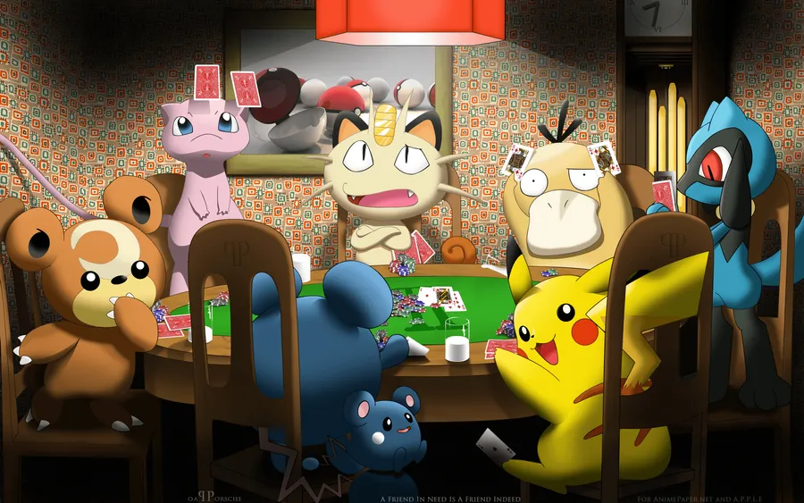
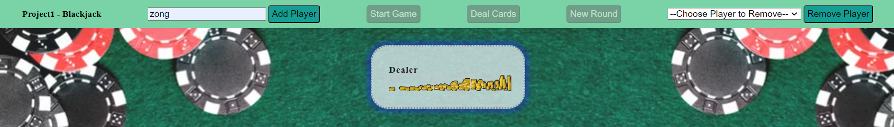
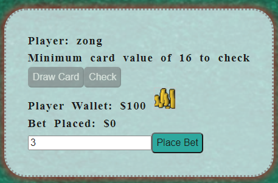
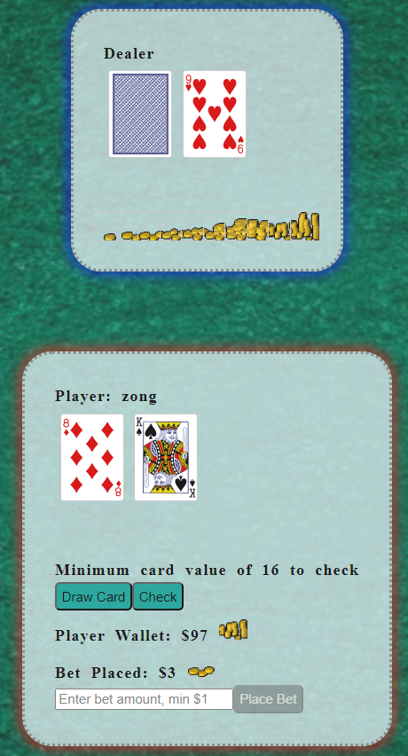
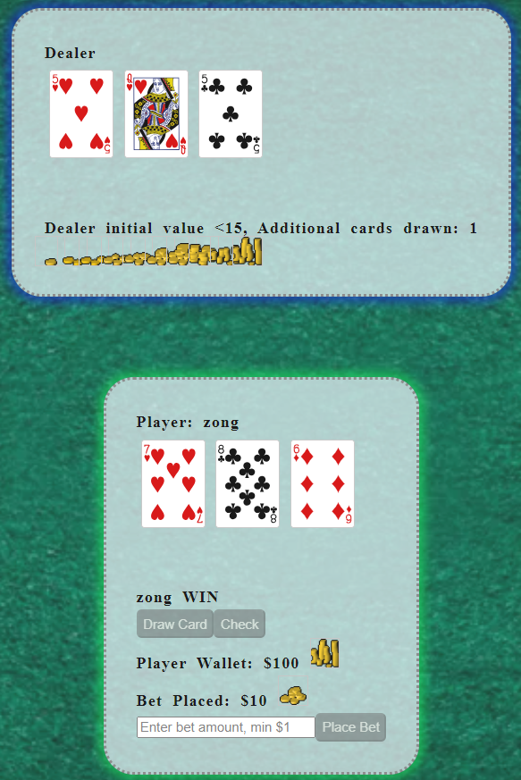
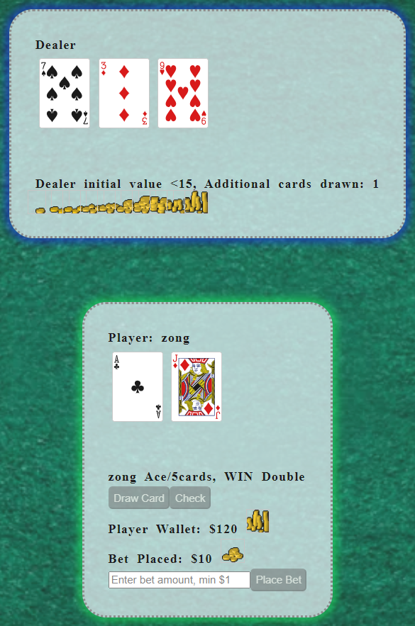

# SEI Course Project 1: Blackjack

(https://wallpapers.com/wallpapers/riolu-at-poker-table-vfghvv76vm07or58/download)

## Links

- Gameplay via [Vercel] (https://blackjack-flax-eta.vercel.app/)
- Add gitPages

## Screen Shots

Add Players

Place Bets

Deal Cards

Draw & Check

Blackjack!

Gameplay

## Getting Started:

1. Decide number of players and names **add**, then press **start**.
2. Input bet amount **bet**.
3. Once all bets in, start game **deal**.
4. Player can view cards and decide to **draw** additional cards or **check**.
5. When the last player **check**s, Dealer shows hand, and Draws as required.
6. Message displays win/lose/draw and bet payout in wallet.
7. Enter **new round**.
8. Back to _Step 1_. **Add** more players if required, then press **start**.

## House Rules

- Minimum card value of 16 to check
- Payouts:

  - Ace Pair : x3
  - Blackjack: x2
  - 5 cards: x2

## Technologies Used:

- Vanilla Javascript
- HTML
- CSS

  ### Done

  1.  create deck (object with suit and value).
  2.  add dealer and players + group player by sections
  3.  randomise next card + update deck (remove from pile)
  4.  dealcard (dealer and player)
  5.  displaycard (dealer vs player)
  6.  hide/show dealerhand, only show 1 card
  7.  need to amended renderCard function to work with additional cards
  8.  draw card vs stay(check).
  9.  dealer draw vs stay condition.
  10. win-lose conditions.
  11. create and display message
  12. function to reject check if playervalue < 16
  13. improve checkdealer index to true/false by player.
  14. message for dealer drawing cards
  15. bet functions & wallet
  16. initial conditions: add player first before start game; bet inputs before deal. no zero/negative inputs. max bet inputs.
  17. reset deck, new game.
  18. disable/enable buttons according to game phases
  19. remove player function.
  20. highlight userbox based on ready-state
  21. added background. added moneystacks img.
  22. added backgroundmusic and mute/unmute functions;

  # Next Steps

  23. ...
